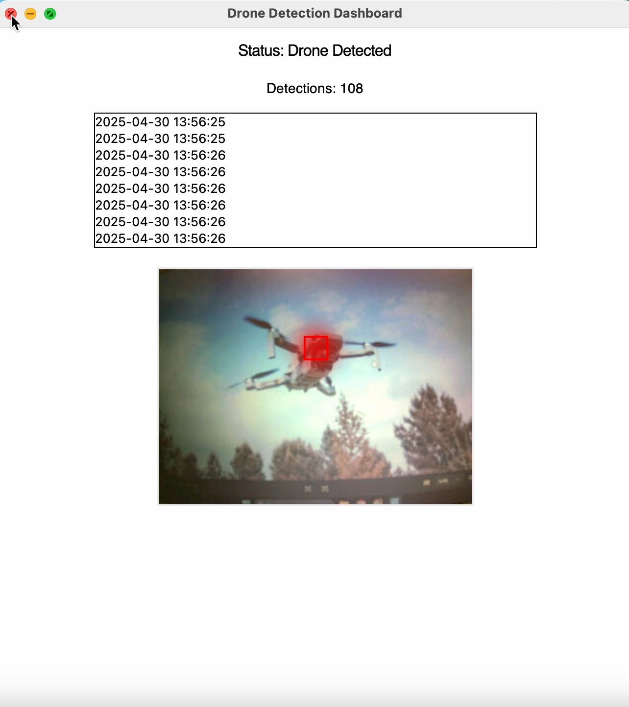
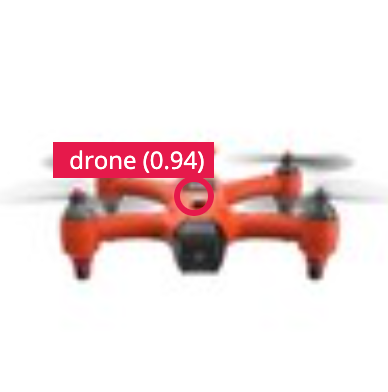
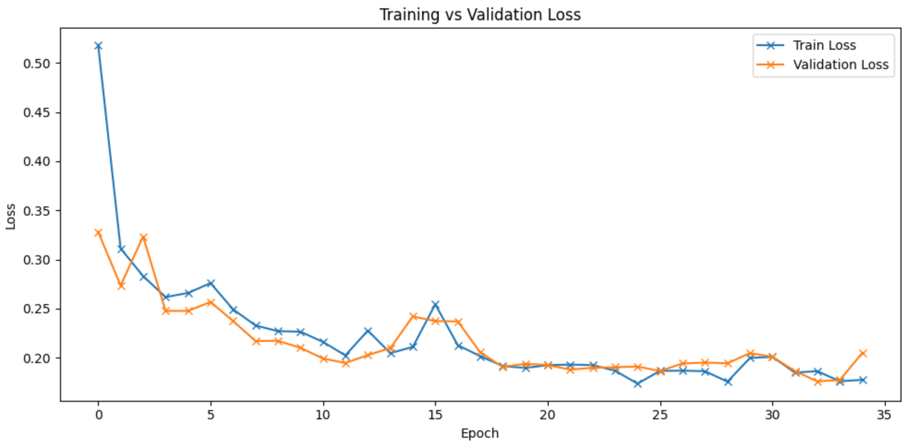
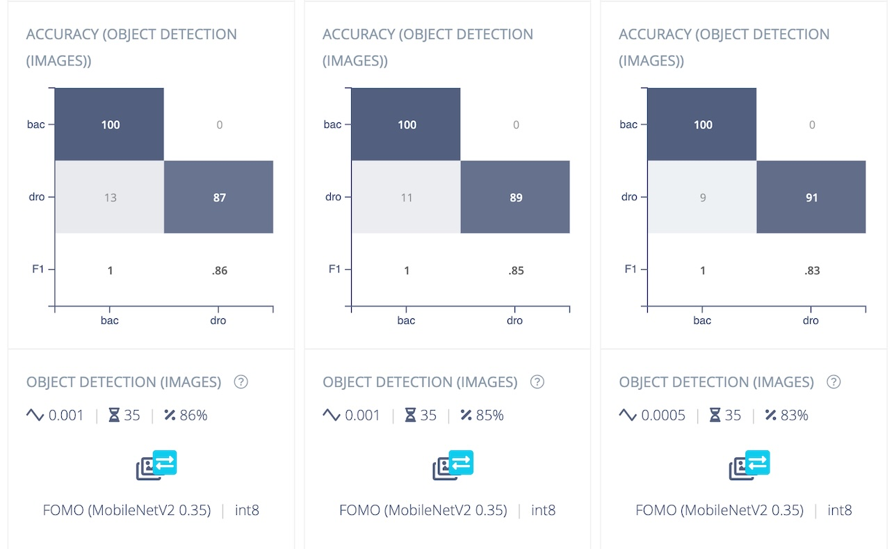

# Drone-Hunter

# 🛡️ Real-Time Drone Hunter (OpenMV-RT1062)

A low-cost, real-time, embedded AI system to detect drones using a microcontroller (OpenMV RT1062) and a quantized object detection model trained with [Edge Impulse](https://www.edgeimpulse.com). This project combines deep learning, transfer learning, real-time visualization, and edge deployment for drone surveillance use cases.

---

## 🔍 Overview

This project enables **on-device drone detection** using:

- 💡 **MobileNetV2 (FOMO)**
- 📷 **Grayscale 96×96 input**
- 🧠 **Edge Impulse model training & optimization**
- 🖥️ **Python GUI for real-time monitoring**
- ⚙️ **OpenMV RT1062 deployment (ARM Cortex-M7, 600 MHz)**

---

## 📦 Contents

| Feature | Screenshot |
|--------|------------|
| Detection Dashboard (Live View) |  |
| Detection Dashboard (Live Video) |  |
| Detection Example |  |
| F1, Precision, Recall over Epochs |  |
| Training vs Validation Loss |  |
| Confusion Matrix |  |
| Feature Explorer (Edge Impulse) |  |

---

## 🧪 Model Training

Model optimized using **Edge Impulse EON Tuner** with top variants:

| Resize Mode | Accuracy | F1 Score | Latency | Model |
|-------------|----------|----------|---------|-------|
| Squash      | 85%      | 0.85     | 10ms    | grayscale-fomo-731 |
| Fit-long    | 85%      | 0.85     | 8ms     | grayscale-fomo-36e |

Final training results:
- **Precision**: 0.87
- **Recall**: 0.98
- **F1 Score**: 0.92
- **Test Accuracy**: 86.02%

---

## 🖼️ GUI Dashboard (Tkinter)

A Python desktop interface was created using **Tkinter** that:
- Displays detection status (`Clear` or `Drone Detected`)
- Logs timestamped detections
- Shows a real-time camera snapshot with bounding box overlay
- Displays detection count

> GUI connects to RT1062 via USB and parses serial messages with coordinates and confidence scores.

---

## 🧰 Tech Stack

- Edge Impulse (FOMO training & EON Tuner)
- TensorFlow (custom fine-tuning)
- OpenMV RT1062 (deployment target)
- Python (GUI, serial communication)
- Matplotlib / Seaborn (visualizations)

---

## ⚠️ Challenges Faced

- Fine-tuning exported TFLite models locally
- Synchronizing UART image/metadata parsing
- GUI performance on real-time image refresh
- Edge Impulse training time limits (free tier)

---

## 🚀 Future Improvements

- Add **audio detection** (e.g., drone propeller sound fusion)
- Expand to **multi-class object detection**
- Enhance GUI with snapshot saving and alert sounds
- Extend FOMO backbone to improve false positive control

---

## 👨‍🎓 Team Members

- **Siddartha Sandeep P**
- **Rajarshi**
- **Neil Shaun**
- **Chandana Bakam**
- **Deepend**

> Supervised by **Dr. Brendan Mullane**  
> MEng Artificial Intelligence & Computer Vision  
> EE6008 – Deep Learning at the Edge Project

---
